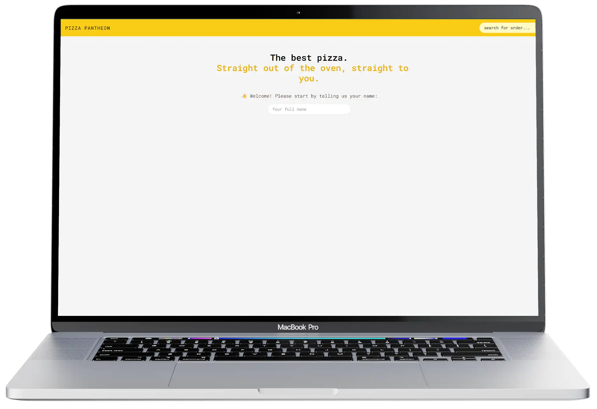

<h1 align='center'>Pizza Pantheon</h1>



## About

Pizza Pantheon is a food ordering application built using ReactJs and TailwindCSS.
Users have the ability to create a new temporary account upon which they will get redirected to the menu page where they can place their order. There is a tracking page once they have completed their order.

## Getting Started

You can visit the live site: https://pizza-pantheon.netlify.app/

Alteratively you can clone this repo

```
  git clone https://github.com/NikeshCohen/Pizza-Pantheon.git
```

```
cd Pizza-Pantheon
```

```
npm i
npm run dev
```
